# Introduction! 👋
Hello! I am **Louie Sebastian Kurenai**, I can be called in various names such as Sebby and Lou.

I am a programmer, gamer and journalist who loves to customize things to whatever matches my vibe.

I am a Linux user, do not hate me for using it since that's my preference.

I mainly play games such as osu! and osu!droid, best rhythm games to play in my opinion.

I use Obsidian as my daily drive for notes because it's flexible and has markdown syntax support.

That's all.

<h3>Operating Systems I've used 💻</h3>

  
*  Windows 11 - I used this before, but due to a recent data loss, I no longer use it until I get a new laptop.
*  Arch Linux - My main operating system, currently using for programming and perhaps studies
*  Ubuntu - My starting point on Linux for personal use, it was fun using it until it slowed down.
*  Android - My main mobile operating system, used for journaling and communication on the go.
*  CachyOS - I've used this before, very optimal performance.

  
<h3>Software I use 📱</h3>

Code editors
* 
* 

  
<h3>Places to contact</h3>

* Main email - paytousebloxy1774@gmail.com
* Backup email - louiesoulenkurenai@gmail.com

  

    <h3>Code Statistics</h3>
  

  
<h3>Donation page links</h3>

* 
*  (currently not working)

